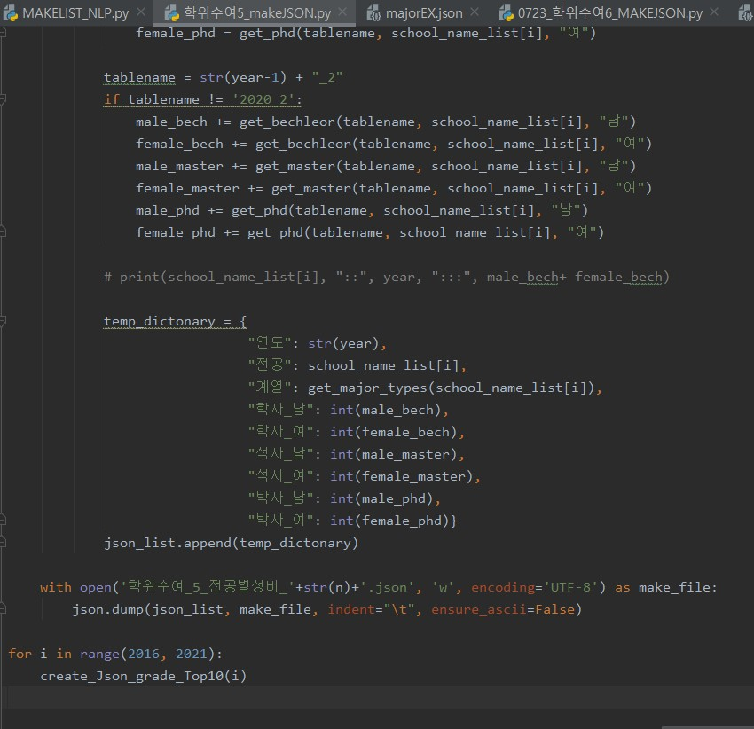
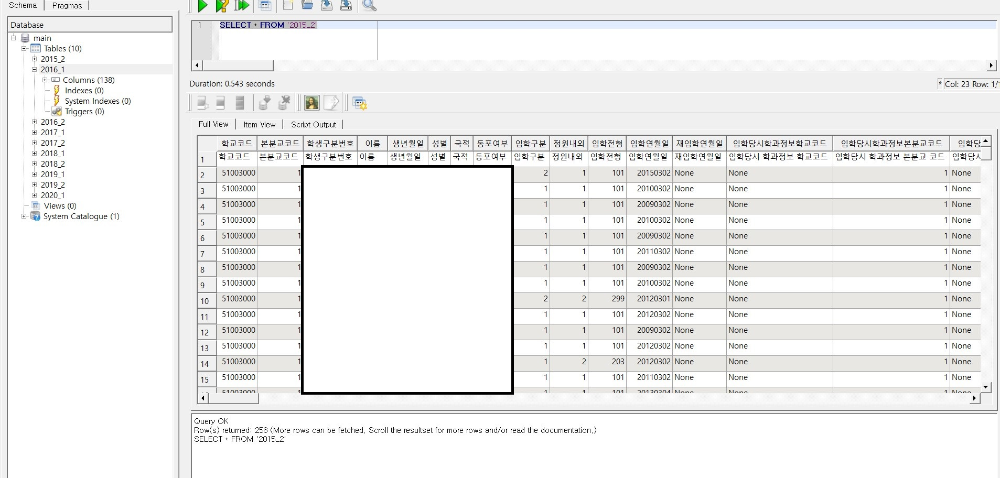

# WebDevScholarship_GlobalPlaza

## 개요 

- 웹페이지 개발 근로 장학생 활동 
- IR센터 웹 개발 프로젝트 From 글로벌플라자 IR센터(Institutional Research Center,KNU Global Plaza 306) 

## 개발 업무내용

- Python 코드를 작성하여 셔플된 학교DB의 특정데이터를 추출하여 교내 웹사이트의 아래와 같은 그래프에 들어갈 데이터를 가공하는 역할을 주로 하였음.

- 필요에 따라 웹페이지에 Javascript,HTML 기반으로 텍스트,버튼을 구현하는 등의 기능을 수정하는 역할을 함.

