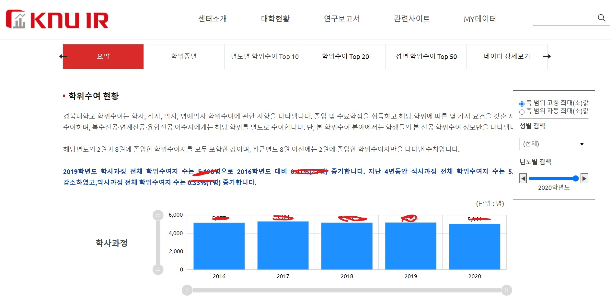
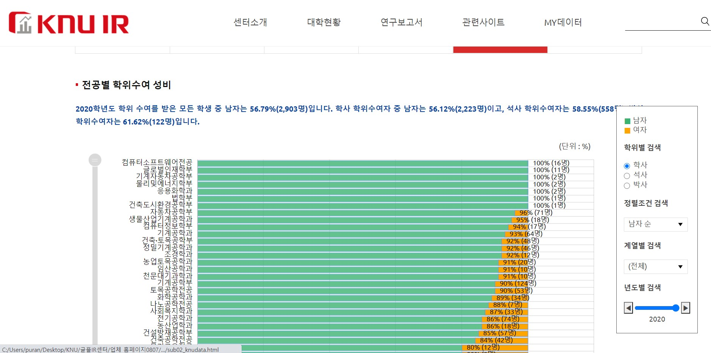
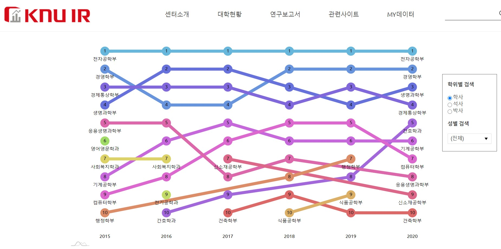

# WebDevScholarship_GlobalPlaza

## 개요 

- 웹페이지 개발 근로 장학생 활동 
- IR센터 웹 개발 프로젝트 From 글로벌플라자 IR센터(Institutional Research Center,KNU Global Plaza 306) 

## 개발 업무내용

- Python 코드를 작성하여 셔플된 학교DB의 특정데이터를 추출하여 교내 웹사이트의 아래와 같은 그래프에 들어갈 데이터를 가공하는 역할을 주로 하였음.

- amChart라는 웹페이지 그래프 제공 라이브러리, html,Javascript 기반 프로그래밍을 통해 웹 사이트에 그래프를 구현하는 역할을 했으며, 필요에 따라 웹페이지에 Javascript,HTML 기반으로 텍스트,버튼을 구현하는 등의 기능을 수정하는 역할을 함.

## 내가 작업한 코드: 파이썬 코드

[코드 폴더 링크]()
 
- 학교 데이터 보안 상, 스스로 만든 코드 외에 웹페이지 관련 코드는 올리지 못하였음.

